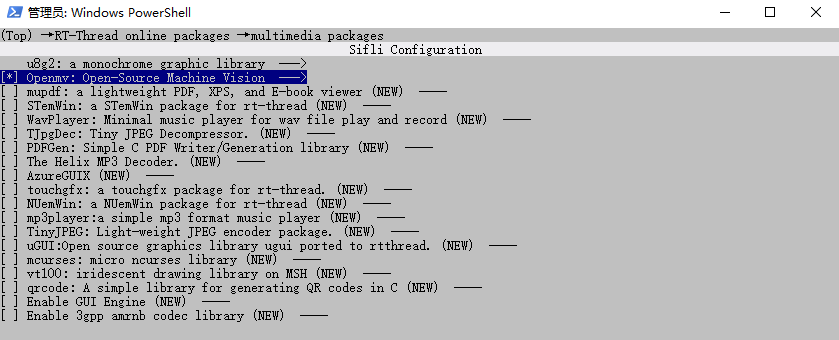
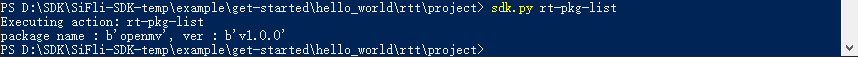
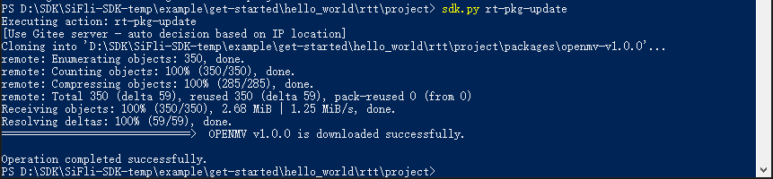
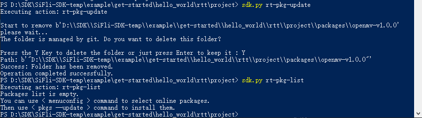
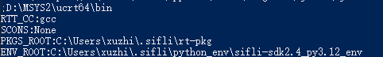

# RT-PKG Command Usage Guide

## Environment Configuration

After configuring the environment using `.\export.ps1` in the SDK path, switch to the project directory where packages need to be configured, and use the following command to enter the configuration interface:

```shell
scons --board=sf32lb52-lcd_n16r8 --menuconfig
```

After entering the configuration interface, select `RT-Thread online packages` to configure the relevant software packages.

**Note**: When using for the first time, you need to execute `sdk.py rt-pkg-upgrade` to download and update the software package configuration.


## Command List

### View Help Information

```shell
sdk.py --help
```

This command can query the usage instructions for rt-pkg related commands.

**Note**: After using this command, if there are no rt-pkg related commands under Commands, please update the local SDK.


### List Configured Packages

```shell
sdk.py rt-pkg-list
```

After adding new packages in `menuconfig`, use this command to output the packages that have been added.

**Usage Example**:
1. Select `RT-Thread online packages` in `menuconfig`
2. Enter `multimedia packages`
3. Press space to select Openmv
4. Save and exit



Using this command, you can see the packages that have been added along with their versions:



### Update Package Configuration

```shell
sdk.py rt-pkg-update
```

After adding new packages in `menuconfig`, use this command to download the corresponding packages.

**Add Operation**:


**Delete Operation**: After deselecting packages in menuconfig, use this command and enter Y to delete the corresponding packages.



### Print Environment Variables

```shell
sdk.py rt-pkg-printenv
```

This command can print environment variables for inspection.



### Upgrade Packages

```shell
sdk.py rt-pkg-upgrade
```

Use this command to upgrade already configured packages. When using rt-pkg for the first time, you need to use this command to configure the packages.


### Upgrade Python Modules

```shell
sdk.py rt-pkg-upgrade-modules
```

Use this command to upgrade Python module objects 

### Create New Package

```shell
sdk.py rt-pkg-wizard
```

Use this command to create new packages using the wizard.

## Usage Process Recommendations
1. First use `sdk.py --help` to view available commands
2. Use `sdk.py rt-pkg-list` to check current configuration
3. Configure required packages through menuconfig
4. Use `sdk.py rt-pkg-update` to update configuration
